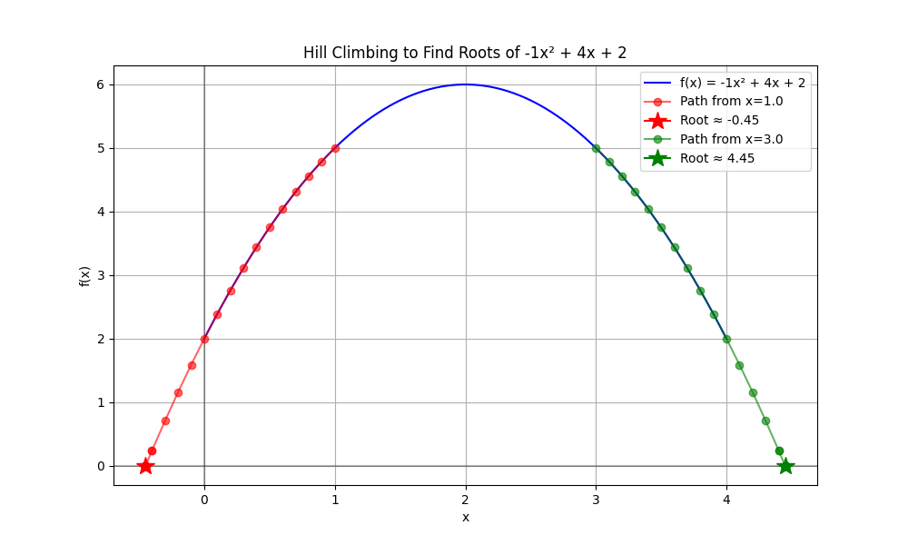

## Hill Climbing Algorithm for Quadratic Roots
This repository contains a Python script that uses a hill climbing algorithm to find the roots of a quadratic function ( f(x) = ax^2 + bx + c ). The algorithm iteratively searches for x-values where ( f(x) = 0 ), starting from points near the quadratic’s vertex. It includes a discriminant check to handle cases with no real roots and visualizes the process using Matplotlib.

## Requirements

- Python 3.x
- NumPy (pip install numpy)
- Matplotlib (pip install matplotlib)

## Installation
 ```bash
    Clone the repository
    git clone https://github.com/Betty987/Hill-climbing.git
    cd Hill-climbing
   ```

## Sample plot 
  

## Report
  